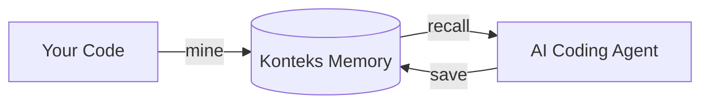

# Konteks

**Konteks** is a memory engine for AI coding agents.

It builds a project-local context graph through autonomous **knowledge curation**, ensuring you **never re-explain your project** to an AI agent.

> **🚧 Work in Progress**: The core architecture is functional, but the retrieval logic and language support are being actively refined.



Memory artifacts are stored directly inside your repository, exposing compact, task-specific recall through an MCP server without requiring global installation or cloud dependencies.

## 🚀 Key Features

* **Zero-Install**: Run anywhere via `npx` or `bunx` without native dependencies.
* **Language-Aware**: Precise semantic parsing via Tree-sitter (not just regex).
* **Local-First**: Your project memory stays in your repo—no cloud, no accounts.
* **Token-Efficient**: High-fidelity context synthesis designed for LLM economy.

## 📖 Documentation

For a deep dive into the philosophy, architecture, and usage, see the [Full Documentation](docs/README.md).

* [Overview](docs/getting-started/overview.md): Vision, Philosophy, and the "Why."
* [Session Lifecycle](docs/getting-started/lifecycle.md): How to work with Konteks (Bootstrap -> Work -> Save).
* [Architecture Overview](docs/core-concepts/overview.md): How the memory engine works under the hood.
* [Glossary](docs/reference/glossary.md): Short definitions for Konteks terms.

## 🛠 Supported Languages

Konteks uses specialized grammars for semantic extraction:

* TypeScript / JavaScript
* HTML / JSDoc
* JSON
* PHP
* *(More coming soon)*

## ⚡ Quickstart

### 1. Initialize Project Memory

Konteks runs on **Node.js (>=22)** or **Bun**. Initialize your project using your preferred package manager:

```bash
npx -y @konteks/cli init
# OR
bunx @konteks/cli init
pnpm dlx @konteks/cli init
yarn dlx @konteks/cli init
```

*(Automatically adds `.konteks/` to your `.gitignore`)*

### 2. Extract Knowledge (Mining)

```bash
npx @konteks/cli mine
```

### 3. Register the MCP Server

Add this to your MCP client configuration (e.g., Claude Desktop):

```json
{
  "mcpServers": {
    "konteks": {
      "command": "npx",
      "args": ["-y", "@konteks/cli", "mcp"]
    }
  }
}
```

**Next: Learn how to use this memory with the [Bootstrap -> Work -> Save lifecycle](docs/getting-started/lifecycle.md).**

## 📂 Local Storage

Konteks writes local memory under `.konteks/`. It uses SQLite (WASM) for the graph/indexes and a content-addressed object store for payloads. No host SQLite client or native modules are required.

## ⚖️ License

MIT Licensed. See [LICENSE](LICENSE) for details.
