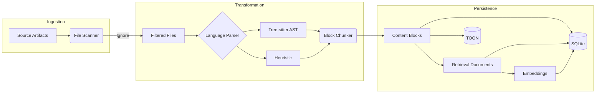

# Extraction & Sectioning: Semantic Extraction

The journey of project knowledge begins with **Semantic Extraction**. This process transforms raw source code and documentation into the **Content Blocks** (technically known as *chunks*) that populate the [Memory Model](memory-model.md).

## 1. The Extraction Lifecycle

Extraction is the process of scanning a repository to capture its latent structure and meaning. This is the primary source of **Derived Memory**—knowledge that can be automatically rebuilt from the source files.

### Concepts

* **Static Analysis**: Konteks examines code without executing it, identifying patterns and relationships.
* **Incremental Extraction**: To maintain efficiency, the system identifies and processes only the files that have changed since the last extraction operation.
* **Mining**: The process of deep-scanning a project to build the semantic graph.

### Technical Specification: The Indexer

* **CLI Commands**:
  * `konteks init`: Initial full index of the project.
  * `konteks repair`: Performs a manual recovery rebuild of all derived artifacts.
* **Ignore Rules**: Respects `.gitignore`, `.ignore`, and built-in defaults (e.g., `node_modules`, `.git`).
* **Metadata Extraction**: Ingests `package.json`, `README.md`, and configuration files to build the initial [Taxonomic Memory](memory-model.md#4-taxonomic-memory).

## 2. Language-Aware Parsing (Tree-sitter)

Traditional tools often split code into arbitrary fixed-size sections (e.g., every 1000 characters). This breaks the "Semantic Integrity" of the code. Konteks uses **Tree-sitter** to understand the actual structure of the code.

### Concepts

* **Abstract Syntax Trees (AST)**: By parsing code into a tree structure, Konteks understands what is a function, a class, or a variable.
* **Content Blocks**: Instead of character counts, Konteks sections code by its logical boundaries (e.g., one block = one function). These are **indexed for semantic search** to allow for high-fidelity retrieval.

### Technical Specification: The Parser

* **Engine**: Web-Tree-Sitter (WASM)
* **Supported Languages**: TypeScript, JavaScript, HTML, JSON, and more.
* **Rationale**: We use WASM builds to maintain our "Zero-Install" promise while gaining the accuracy of a full compiler-grade parser.

## 3. Sectioning Strategies

Different types of files require different extraction strategies to ensure high-fidelity [Recall](recall.md).

### Code Sectioning

* **Target**: One logical unit (Function/Class/Component).
* **Size**: Typically 300–900 tokens.
* **Metadata**: Each block is tagged with its parent file, module name, and symbol signature.

### Markdown & Prose

* **Target**: Heading-based sections.
* **Overlap**: Minimal overlap is used to preserve context at the boundaries of sections.

### Data & Config (JSON/YAML)

* **Target**: Meaningful object paths.
* **Structure**: Preserves the path hierarchy (e.g., `compilerOptions.target`) within the section metadata.

## 4. Embedding Generation

Sectioning creates the units of memory, but embeddings make those units searchable by meaning rather than exact wording. An embedding is a numeric representation of a retrieval document. Texts with related intent should land near each other in vector space, even when they use different keywords.

Konteks builds two retrieval views for each searchable target:

* **FTS Text**: A broader text surface used for lexical matching through SQLite FTS.
* **Embedding Text**: A bounded, metadata-rich text surface optimized for semantic matching.

The embedding input includes contextual metadata such as path, source role, language, anchor, topics, summary, and a content excerpt. This helps the model represent not just the raw text, but also where the text belongs in the project.

### Technical Specification: Embeddings

* **Default Provider**: `HuggingFaceEmbeddingProvider`.
* **Default Model**: `Xenova/all-MiniLM-L6-v2`.
* **Dimensions**: 384.
* **Pooling**: Mean pooling.
* **Normalization**: Enabled, so vectors can be compared with cosine similarity.
* **Storage**: Vectors are written as `float32` blobs for targets such as chunks, modules, durable memories, and diary entries.
* **Reuse**: Existing vectors are reused when the provider model and embedding hash are unchanged.
* **Model Cache**: Model files are cached globally, using `KONTEKS_MODEL_CACHE_DIR` when set or `~/.cache/konteks/models` by default.

---

**How is this knowledge used?** Read about [Recall & Contextual Synthesis](recall.md).
