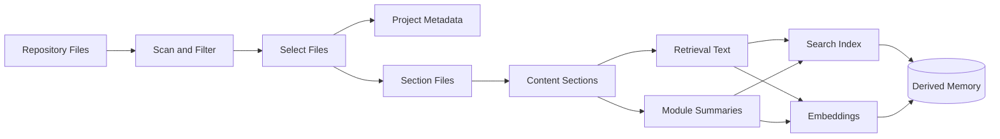

# Extraction & Sectioning: Semantic Extraction

Every project begins as a forest of files: source code, documentation, configuration, notes, and generated noise. Extraction is the pass where Konteks walks that forest and turns the parts worth remembering into derived memory.

This is not execution. Konteks does not run the project or interpret business behavior at runtime. It reads the repository, keeps the useful artifacts, divides them into meaningful sections, and prepares them so future recall can find the right context.

## 1. The Gate: Scan and Filter

Extraction starts at the project root. Konteks walks the repository and records enough about each included file to know what exists now and what changed since the last extraction.

Before anything becomes memory, it passes through a gate. Konteks excludes its own memory directory, Git internals, secret files, noisy generated outputs, and paths excluded by ignore files:

* Files excluded by `.gitignore` or `.konteksignore`.
* Git and Konteks internal directories.
* Environment, certificate, and key files.
* Binary, generated, minified, vendored, and lockfile paths.

What remains is the working set. Project-specific unusually large files or other repository noise should be excluded by the repository's `.gitignore` or `.konteksignore`.

## 2. The Ledger: Select What Needs Work

Konteks does not always need to re-read the whole project. It keeps a record of the previous extraction and uses that record to decide what should happen next.

* A full extraction extracts the current included files.
* A changed extraction extracts files whose content changed and removes memory for files that disappeared.
* A resume extraction skips paths that are already present in memory.
* A rebuild extraction rebuilds derived artifacts from the current included files.

This is the boundary between derived and durable memory. Derived memory can be rebuilt from the repository; durable memories saved from agent sessions are not treated as throwaway extraction output.

## 3. The Project Portrait: Read Metadata

Before Konteks studies individual files, it builds a small portrait of the project. It looks for package information, entry points, scripts, dependencies, workspace hints, README-derived description, and broad technology signals.

This portrait gives later memory a frame. A section from a file is more useful when the system also understands the package, workspace, and technology context around it.

## 4. The Sectioning: Split Files into Sections

A file is often too large and too mixed to be useful as one memory unit. Sectioning turns each included file into sections, which are the derived memory units Konteks expects to retrieve directly.

Konteks chooses the sectioning path from the file shape:

* Code files are sectioned by symbols when parser metadata is available.
* Code parser fallback uses recognizable symbol declarations when parser metadata is unavailable.
* Markdown files are sectioned by headings.
* JSON files are sectioned by top-level object keys when possible.
* Other text files are stored as one file-level section.

Empty files produce no sections. Konteks does not split sections solely by size; file hygiene belongs in project ignore rules.

## 5. The Name and Place: Attach Context

A section is not just text. It needs a name, a place, and enough surrounding detail to be useful later.

Konteks attaches context such as:

* Its path, anchor, heading, symbol, or JSON path.
* Its content kind: code, markdown, JSON, or text.
* How it was parsed: parser-backed or fallback sectioning.
* Topics inferred from the path, summary, and content.
* Its extracted content, stored directly in SQLite.

Konteks also records the file as a source and links sections into a path-based taxonomy. That gives recall a way to move from one matched section to the surrounding project area.

## 6. The Search Voice: Build Retrieval Text

The raw section body is not always the best search surface. A section often needs its path, role, language, anchor, topics, and summary beside it before it can be found reliably.

Konteks therefore prepares retrieval text for each searchable target:

* Lexical text favors exact matching and broad keyword coverage.
* Embedding text carries the same section content plus location metadata for semantic matching.

This gives recall two voices for the same memory: one for exact project terms, and one for meaning.

## 7. The Map: Rebuild Module Artifacts

Once sections are in place, Konteks rebuilds module artifacts from the current section set.

A module artifact is a higher-level map of a project area. It summarizes a top-level path by file count, section count, source role, path-derived topics, and package metadata when available.

Modules matter because an agent often needs orientation before details. Recall can surface a project area first, then narrow into individual sections.

## 8. The Meaning Trace: Generate Embeddings

After retrieval text exists, Konteks can generate embeddings for extracted sections and module artifacts.

An embedding is a compact representation of what a section or module is about. It lets recall compare related meanings even when the task and the project use different words.

Konteks reuses an existing embedding when the retrieval text and embedding model are unchanged. When the text changes, the target is embedded again so semantic recall follows the current repository state.

## 9. The Seal: Write Summary and Manifest

At the end, Konteks writes a project summary and an extraction manifest.

The summary captures the broad project picture from the scan and metadata. The manifest records what was extracted, when it was extracted, which mode was used, and diagnostic counts such as extracted sections, parser usage, skipped files, and embedding reuse.

The manifest is the seal on the extraction run. It lets the next run know what has already been seen, what changed, and how to continue without starting from nothing.

---

**How is this knowledge used?** Read about [Recall & Contextual Synthesis](recall.md).
