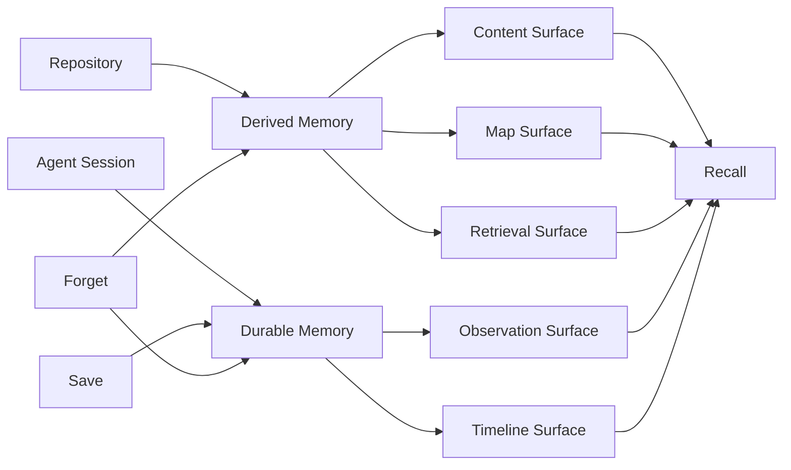

# Memory Model: The Surfaces of Project Knowledge

Konteks memory is not one long note. It is a set of connected surfaces that help an agent answer different questions about the same project: what exists, what matters, where it belongs, what changed, and what should be remembered.

The model has two sources of truth:

* **Derived memory** comes from the repository. It is rebuilt from files, metadata, chunks, modules, retrieval text, and embeddings.
* **Durable memory** comes from agent sessions. It is saved intentionally as observations, decisions, constraints, preferences, blockers, code insights, and diary entries.

Derived memory is allowed to change when the project changes. Durable memory is preserved until it is explicitly forgotten or suppressed.

## 1. The Content Surface

The first surface is made from the repository itself. During extraction, Konteks reads included files and divides them into chunks.

A chunk is the smallest derived memory unit Konteks expects to retrieve directly. It carries the content plus the clues that make the content useful later: path, anchor, kind, summary, topics, and parser context when available.

This surface answers:

* Which part of the project contains the relevant code or prose?
* What is the smallest useful section to inspect?
* Where should an agent look next?

Content memory is rebuildable. If a file changes, the affected chunks can be replaced. If a file disappears, stale chunks can be removed.

## 2. The Map Surface

Chunks are useful, but an agent also needs orientation. Konteks builds a map above individual chunks.

The current map is shaped mainly by:

* **Sources**: the files that produced chunks.
* **Path taxonomy**: a directory-shaped grouping of chunks.
* **Modules**: summaries of top-level project areas, including file and section counts.
* **Project metadata**: package, workspace, dependency, entry point, README, and technology signals when available.

This surface answers:

* What are the major areas of the project?
* Which files belong together?
* Which project areas are likely important before reading a specific chunk?

Konteks also has a graph layer for named entities and relations. Recall can search those entities, traverse nearby relations, and include historical relations when a task asks about prior decisions or changes. In the current extraction flow, the strongest automatically rebuilt map comes from files, paths, modules, and metadata.

## 3. The Retrieval Surface

The retrieval surface is the search-facing version of memory. It is built from chunks, modules, saved observations, and diary entries.

Konteks does not rely only on raw content. It prepares retrieval text that includes both the content and the context around it. This lets recall match a task against what a section means, where it lives, and why it may matter.

There are two retrieval voices:

* **Lexical matching** favors exact terms, names, paths, and project vocabulary.
* **Semantic matching** uses embeddings to compare meaning when the wording differs.

This surface answers:

* Which memories match the task text?
* Which memories are semantically close to the task?
* Which candidates should be ranked higher before recall assembles the final context?

During extraction, chunks and module artifacts receive embeddings. Saved observations and diary entries receive retrieval text when they are saved, so they can also participate in recall and warm-up flows.

## 4. The Observation Surface

The observation surface is durable memory saved from agent work. These are not mined from source files; they are deliberately recorded because future sessions should know them.

Observation kinds describe why a memory matters:

* **Decision**: a chosen direction.
* **Constraint**: a rule or limit that must be followed.
* **Preference**: a style or workflow convention.
* **Code insight**: a useful fact about how implementation works.
* **Blocker**: an unresolved problem.
* **Fact**: stable project knowledge.
* **Note**: useful lower-specificity context.

This surface answers:

* What did the user or agent decide?
* What rules should future work respect?
* What implementation knowledge is not obvious from reading one file?

Observations are deduplicated by content. Low-quality or sensitive content is rejected before it becomes memory.

## 5. The Timeline Surface

The timeline surface preserves the order of meaningful work.

It has two parts:

* **Diary entries** summarize completed or partial sessions.
* **Memory events** record meaningful mutations such as saves, diary writes, forgetting, suppression, and extraction events.

This surface answers:

* What happened recently?
* What was completed, blocked, or left for later?
* Why did memory change?

Diary entries are for handoff and continuity. Memory events are for traceability.

## 6. The Warm-Up View

Warm Up reads across the model to build a stable project briefing.

It draws from the extraction manifest, project metadata, module summaries, retrieval highlights, and recent durable guidance. The goal is not to return every memory. The goal is to give the agent enough stable context to start a session without making the user re-explain the project.

This view favors:

* Project summary and technologies.
* Entry points and key files.
* Important modules and highlighted chunks.
* Recent durable decisions, constraints, and conventions.

## 7. The Recall View

Recall is the task-shaped view of memory.

When an agent asks for context about a task, Konteks searches retrieval memory, looks for matching entities, expands nearby graph relations when available, and includes historical relation evidence when the task asks for prior or superseded context.

Recall returns a compact package rather than a raw dump. It includes a brief, primary targets, selected memories, graph evidence, history evidence, and a quality signal.

## 8. Forgetting and Hygiene

Memory can be wrong, stale, sensitive, or no longer useful. Konteks treats forgetting as part of the model rather than an afterthought.

There are three ways memory can be changed:

* **Soft delete** hides memory from normal recall while keeping a trace.
* **Invalidate** suppresses memory that should no longer guide future work.
* **Hard delete** removes memory when it should not remain.

Forgetting can target saved observations, diary entries, mined chunks, and graph relations depending on how it is requested. Each successful change is recorded as a memory event.

---

**How is this knowledge acquired?** Read about [Semantic Extraction](extraction.md).  
**How is it used?** Read about [Recall & Contextual Synthesis](recall.md).
