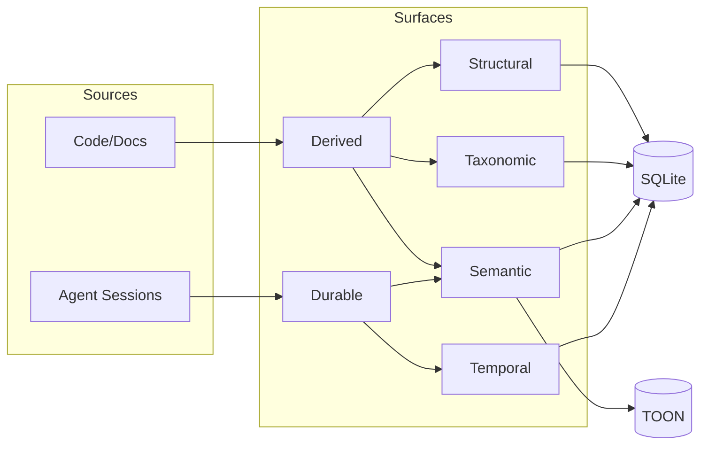

# Memory Model: The Surfaces of Project Knowledge

Konteks represents a project not as a flat list of files, but as a multi-dimensional **semantic graph**. This model allows the system to store and retrieve knowledge across four distinct surfaces, each serving a specific role in the [Knowledge Journey](overview.md).

## Durable vs. Derived Data

A fundamental distinction in the Konteks memory model is the difference between **Durable** and **Derived** knowledge.

* **Durable Memory**: Intentional knowledge created by users or agents during sessions. This includes observations, diary entries, and task handoffs. Durable memory is **authoritative** and is preserved across system repairs or re-indexing.
* **Derived Memory**: Knowledge automatically extracted from source code, documentation, and project structure. This includes entities, relations, and code chunks. Derived memory is **reproducible** and can be rebuilt by running a project "repair" operation.

## 1. Structural Memory (Derived)

Structural memory represents the "skeleton" of your project. It captures the entities and the rigid relationships that define your architecture.

### Concepts

* **Entities**: The nodes of the graph. These include files, modules, classes, functions, and high-level features.
* **Relations**: The edges connecting entities (e.g., `Feature A` -> `implemented_in` -> `File B`).
* **Graph Expansion**: The ability to navigate these links during recall to find "hidden" context and dependencies.
* **Modules**: High-level groupings of files that define the project's macro-architecture.

### Technical Specification

| Table | Purpose | Key Fields |
| :--- | :--- | :--- |
| `entities` | Stores unique project artifacts | `id`, `type`, `name`, `canonical_name` |
| `relations` | Stores typed links between entities | `subject_id`, `predicate`, `object_id`, `confidence` |
| `modules` | Stores architectural module summaries | `path`, `summary`, `exported_symbols_json` |

## 2. Semantic Memory (Durable & Derived)

Semantic memory captures the "meaning" within your project. It stores atomic units of knowledge and high-level observations.

### Concepts

* **Chunks (Derived)**: Atomic, semantic sections of code or text extracted from source files.
* **Observations (Durable)**: Facts, insights, or constraints captured during agent sessions.
* **Retrieval Documents**: Search-oriented projections of chunks, modules, memories, and diary entries. They keep separate text for lexical search and embedding generation.
* **Embeddings**: Numeric vectors derived from retrieval documents so semantically similar knowledge can be compared even when the words differ.

### Memory Kinds (Observations)

Durable observations are categorized by their intent:

| Kind | Usage |
| :--- | :--- |
| `fact` | Objective truths about the project (e.g., "The production DB is PostgreSQL"). |
| `decision` | Architectural or design choices (e.g., "We use Vitest for all new tests"). |
| `constraint` | Hard requirements or limitations (e.g., "Must support Node 18+"). |
| `preference` | Style or workflow preferences (e.g., "Prefer functional components"). |
| `code_insight` | Non-obvious logic details (e.g., "The retry logic has an exponential backoff"). |
| `blocker` | Known issues preventing progress. |
| `note` | General-purpose ephemeral notes. |

### Technical Specification

| Table | Purpose | Key Fields |
| :--- | :--- | :--- |
| `chunks` | Atomic sections of code/text | `content_hash`, `summary`, `token_count`, `path`, `anchor` |
| `observations` | Durable facts and insights | `kind`, `text_inline`, `payload_ref`, `confidence` |
| `retrieval_documents` | Search projections for memory targets | `target_id`, `target_type`, `fts_text`, `embedding_text` |
| `target_embeddings` | Vector index for retrieval documents | `target_id`, `target_type`, `model`, `dimensions`, `vector_blob` |

## 3. Temporal Memory (Durable)

Temporal memory tracks the "when." It provides the chronological context required to understand how a project has evolved and what decisions are currently active.

### Concepts

* **Diary Entries**: Structured summaries of work sessions, including tasks performed and status.
* **Memory Events**: An append-only audit log of every meaningful memory mutation (creation, deletion, suppression).

### Technical Specification

| Table | Purpose | Key Fields |
| :--- | :--- | :--- |
| `diary_entries` | Saved summaries of agent sessions | `subject`, `summary`, `tags_json`, `created_at` |
| `memory_events` | The master chronological audit log | `event_type`, `subject_id`, `summary`, `actor` |

## 4. Taxonomic Memory (Derived)

Taxonomic memory provides the "where." It organizes knowledge into project-specific scopes to ensure that retrieval is always contextually relevant.

### Concepts

* **Taxonomy Nodes**: The labels in your ontology (e.g., `api`, `ui`, `database`).
* **Taxonomy Links**: Assignments of entities and chunks to specific nodes.

### Technical Specification

| Table | Purpose | Key Fields |
| :--- | :--- | :--- |
| `taxonomy_nodes` | The labels in your ontology | `name`, `parent_id`, `summary` |
| `taxonomy_links` | Assignments of targets to nodes | `target_id`, `target_type`, `node_id` |

---

## Memory Mutation and Hygiene

Memory in Konteks is not static; it is managed through explicit mutation tools to ensure reliability and privacy.

### Save vs. Remember

* `konteks_save`: Used for **Full Session Handoffs**. It records a comprehensive summary of a task, its status, and any new diary entries.
* `konteks_remember`: Used for **Lightweight Observations**. It saves a single durable observation (e.g., a new `decision` or `preference`) without closing the session.

### Forgetting and Suppression

Knowledge can be removed or invalidated using `konteks_forget` with three distinct modes:

1. **Soft Delete** (`soft_delete`): Marks the memory as deleted. It will no longer appear in standard recall but remains in the database for audit and recovery.
2. **Invalidate** (`invalidate`): Marks the memory as "suppressed." Useful for knowledge that was once true but has been superseded.
3. **Hard Delete** (`hard_delete`): Completely removes the record from the database.

---

**How is this knowledge acquired?** Read about [Semantic Extraction](extraction.md).
