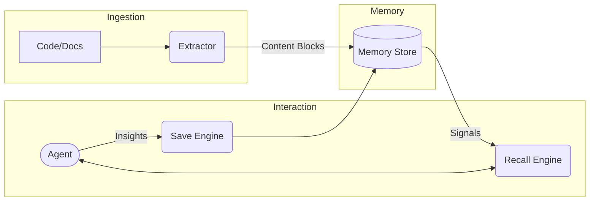

# Architecture Overview: The Journey of Project Knowledge

This document describes how Konteks transforms a static repository into a living **semantic substrate**. We follow the journey of project knowledge—from its latent state in source code to its final synthesis as a "Recall Package" for an AI agent.

The following chart illustrates the high-level system interactions between the User (CLI), the Agent (MCP), and the underlying storage engine.

## Overview: The Mission of Context

At the heart of every software project lies a vast amount of latent knowledge: decisions made in commits, relationships between modules, and the chronological evolution of features. Typically, this knowledge is "forgotten" between AI [sessions](../reference/glossary.md#session), forcing agents into a cycle of constant rediscovery.

Konteks acts as a **memory engine**. Its architecture is built to systematically capture this latent knowledge through **knowledge curation** and consolidate it into a durable, project-local memory. By grounding agentic work in this memory, we enable a development experience where the agent is already "familiar" with the project's soul.

## System Architecture: The Memory Environment

To facilitate the journey of knowledge, Konteks provides a multi-layered environment designed for high-fidelity preservation and zero-friction access.

### 1. Interface Modalities

Knowledge enters and exits the system through two primary modalities. The **Administrative Interface (CLI)** serves as the orchestrator for extraction and system management, while the **Service Interface (MCP)** provides the bridge for AI agents to interact with the project's memory during a [session](../reference/glossary.md#session).

### 2. The Cognitive Framework

The core of the system is a framework that manages four distinct "surfaces" of memory. Together, they form a [Memory Model](memory-model.md) that represents the project's state:

* **Structural Memory** captures the skeleton of the project—how features and modules relate.
* **Semantic Memory** preserves the meaning—the specific "what" and "how" found in code and notes.
* **Temporal Memory** tracks the "when"—the chronological timeline of decisions and tasks.
* **Taxonomic Memory** provides the "where"—organizing everything into project-specific scopes.

### 3. The Persistence Substrate

This knowledge is anchored in a [Storage Substrate](storage.md) that ensures privacy and portability. By using a relational core (WASM SQLite) and a content-addressed object store (TOON), Konteks ensures that memory is as durable and portable as the repository itself.

## The Analytic Pipeline: The Life of a Context Signal

The journey of a single piece of knowledge follows a formal analytic pipeline, evolving from raw text to synthesized insight.

The **Knowledge Transformation Pipeline** below maps the evolution of raw source artifacts into synthesized recall and reinforced insights.

### 1. Emergence: Semantic Extraction

The journey begins with [Extraction](extraction.md). Konteks performs language-aware static analysis of your source artifacts. It doesn't just "read" code; it decomposes it into **Content Blocks** (technically known as *chunks*). Using advanced parsing, the system identifies the boundaries of functions, the intent of components, and the hidden links between files.

### 2. Consolidation: Formal Indexing

Once extracted, these units are ingested into the memory framework. They are indexed, cross-referenced, and woven into the project's semantic graph. Here, raw code fragments become **Consolidated Knowledge**, gaining context from their neighbors and their place in the project's taxonomy.

### 3. Awakening: Contextual Synthesis

When an agent begins a task, it initiates [Recall](recall.md). The system performs a multi-phase synthesis, pulling disparate signals from the search index and the graph. These signals are ranked, pruned, and compressed into a **Recall Package**—a token-efficient "brain dump" that gives the agent the exact context it needs for the current prompt.

### 4. Reinforcement: Knowledge Consolidation

The journey doesn't end with recall. As the agent works, its new findings and decisions are saved back into the substrate. This ensures that the project memory is self-reinforcing, growing stronger with every [session](../reference/glossary.md#session).

---

**Ready to see the technical details?** Dive into the [Memory Model](memory-model.md) or explore the [Storage Substrate](storage.md).
