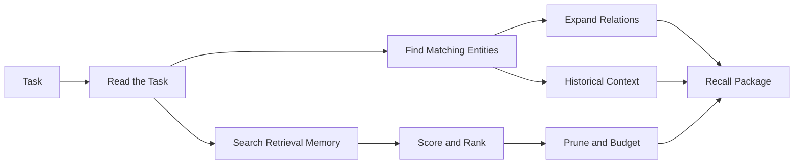

# Recall & Retrieval: Contextual Synthesis

Recall is the moment Konteks turns stored memory back into working context. The user gives a task, and Konteks gathers the most relevant project evidence into a compact package an agent can use immediately.

Recall is not the same thing as search. Search finds matching records. Recall chooses, ranks, trims, and explains context for a specific task.

## 1. The Request: Read the Task

Recall begins with the task text. Konteks breaks the task into searchable terms and uses those terms to infer intent.

Intent matters because not every task needs the same shape of context. A question about documentation, package setup, implementation code, tests, prior decisions, or historical changes should not pull the same evidence with the same priority.

If the task has no useful searchable terms, recall returns no evidence instead of guessing.

## 2. The First Pass: Search Retrieval Memory

Konteks first searches retrieval memory. This is the search-facing layer built from chunks, modules, saved observations, and diary entries.

The first pass favors text-grounded candidates. It looks for exact project vocabulary such as symbols, paths, modules, commands, decisions, and topic words. When compatible embeddings are available, semantic similarity can improve the rank of those text-grounded candidates.

This means embeddings help recall judge meaning, but they do not replace grounded project evidence. If embedding support is unavailable or incompatible for a candidate, recall continues with lexical and structural signals.

## 3. The Safety Net: Fallback Search

If retrieval memory does not produce results, Konteks falls back to older search surfaces when they are available.

If that still produces nothing, it searches saved observations and diary entries directly. This keeps durable session knowledge discoverable even when the richer retrieval surface is missing, stale, or incomplete.

The fallback path is intentionally conservative: return useful memory when possible, but avoid inventing context when the project has no matching evidence.

## 4. The Weighing: Score and Rank

Every candidate is weighed before it reaches the final package.

The score reflects several signals:

* **Lexical match**: whether the task terms appear in the candidate.
* **Semantic closeness**: whether compatible embeddings suggest related meaning.
* **Confidence**: how trustworthy the memory is.
* **Recency**: whether the memory is fresh enough to matter.
* **Size cost**: whether the candidate is too large for the available context budget.
* **Role and intent fit**: whether the candidate type fits what the task appears to need.

Konteks then prunes candidates so one group of similar results does not drown out the rest. The goal is a useful spread of evidence, not a long list of near-duplicates.

## 5. The Map: Expand Relations

Recall also asks whether the task matches known entities. If it does, Konteks can expand from those entities to nearby relations.

This is the map layer of recall. It helps the agent see surrounding context: related components, connected concepts, and nearby decisions. When graph data is sparse, recall still works from retrieval memory alone.

If the task asks about prior work, replacements, migrations, or why something changed, recall can also include historical relation evidence.

## 6. The Assembly: Build the Recall Package

The final package is compact by design. Konteks deduplicates memories, applies the token budget, selects primary targets, and labels the quality of the result.

A recall package contains:

* **Brief**: a short summary of the recall strength and evidence.
* **Primary targets**: files, modules, or records to inspect first.
* **Memories**: selected chunks, modules, observations, and diary entries.
* **Graph evidence**: active relation context when available.
* **History evidence**: superseded or invalidated relation context when relevant.
* **Quality**: `strong`, `partial`, or `weak`.

By default, recall keeps the package compact. When source detail is requested, it can include fuller scoring and relation evidence.

## 7. The Quality Signal

The quality label tells the agent how much trust to place in the returned context.

* **Strong** means the package has high-scoring evidence across more than one target.
* **Partial** means there is useful evidence, but the match may need verification.
* **Weak** means recall found little or no direct support.

The label is not a claim that the answer is correct. It is a warning light for how much the agent should verify before acting.

---

**Where does recall get its memory?** Read [Memory Model](memory-model.md).  
**How is that memory created?** Read [Semantic Extraction](extraction.md).
