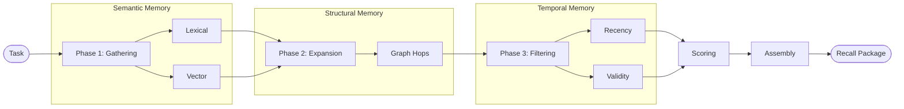

# Recall & Retrieval: Contextual Synthesis

The "Awakening" of project knowledge occurs during **Contextual Synthesis**. This is the process of retrieving disparate signals from the [Storage Substrate](storage.md) and compiling them into a token-efficient package for an AI agent.

## 1. The Recall Goal

Unlike a simple search engine that returns a list of documents, Konteks aims for **Recall**.

* **Search**: Finding documents that match keywords.
* **Recall**: Synthesizing the *exact* context needed to perform a specific task.

## 2. The Retrieval Pipeline

When an agent requests `recall(task)`, Konteks executes a multi-stage pipeline to synthesize the most relevant context.

### Phase 1: Candidate Gathering

The system performs a multi-modal search across [Semantic Memory](memory-model.md#2-semantic-memory).

* **Lexical Search**: Matching exact keywords in code and notes via SQLite FTS.
* **Semantic Search**: Matching the "intent" of the task against section summaries.

### Phase 2: Relational Expansion

Konteks uses its [Structural Memory](memory-model.md#1-structural-memory) to find "hidden" context.

* **Graph Navigation**: If a entity is matched, Konteks expands the graph to find its parent class, its dependencies, and any related architectural decisions.
* **Hops**: By default, the system explores 1-2 "hops" from the primary candidates to build a complete mental model.

### Phase 3: Chronological Filtering

Using [Temporal Memory](memory-model.md#3-temporal-memory), the system filters the candidates.

* **Recency Bias**: Newer decisions and diary entries are prioritized over stale ones.
* **Validity Check**: Superseded relations or invalidated observations are pruned from the result set.

## 3. Scoring & Quality Labels

Not all knowledge is equal. Konteks ranks candidates using a combined scoring algorithm and provides a **Quality Label** to help the agent understand the reliability of the recall.

### Quality Labels

| Label | Meaning |
| :--- | :--- |
| `strong` | High-confidence matches found in primary project code or authoritative docs. |
| `partial` | Some relevant signals found, but may lack depth or direct implementation hits. |
| `weak` | Low-confidence or no direct matches; the agent should proceed with caution and verify. |

### Scoring Factors

$$Score = Relevance + Importance + Recency - Complexity$$

* **Relevance**: How well it matches the specific task.
* **Importance**: High-level architectural decisions are boosted.
* **Recency**: New knowledge is preferred.
* **Complexity**: Very large sections are penalized to respect the token budget.

## 4. Context Assembly

The final step is the construction of the **Recall Package**.

### Concepts

* **Token Budgeting**: Konteks respects a strict token limit (default: 2000 tokens) to ensure the agent has room to think.
* **Content Compression**: Large code sections are often returned as "summaries" first, with full bodies loaded only if the agent requests them.

### Technical Specification: The Recall Package

The package is a compact structured object containing:

1. **Brief**: A short task-oriented summary of the returned evidence (including the quality label).
2. **Primary Targets**: The files, modules, or records the agent should inspect first.
3. **Memories**: The highest-scoring content blocks, modules, durable memories, and diary entries.
4. **Graph and History Evidence**: Active and historical relations when they add context.
5. **Quality**: The calculated `strong`, `partial`, or `weak` signal.

By default, recall favors concise output. Set `includeSources: true` when you need record IDs, scores, score details, or specific timestamps for debugging.

---

**Back to the beginning?** Return to the [Architecture Overview](overview.md) or start with the [Quickstart](../getting-started/quickstart.md).
