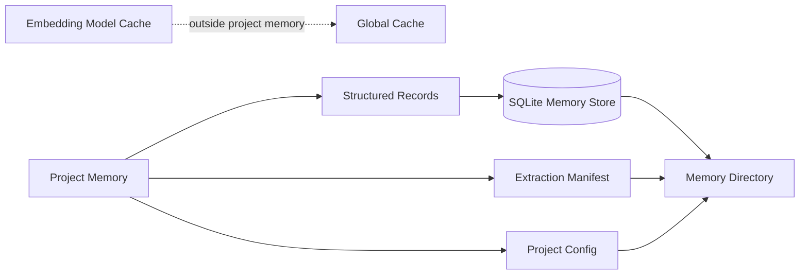

# Storage & Persistence: Keeping Memory Local

Konteks memory lives with the project. Storage is the quiet layer that keeps extracted knowledge, saved observations, diary entries, and retrieval text available across agent sessions.

The storage model has one central promise: project memory should be local, portable, and rebuildable where possible.

## 1. The Home: Project Memory Directory

Konteks keeps project memory under the repository memory directory. By default, that directory is `.konteks/`.

This directory holds the project configuration, local memory database, and extraction manifest. Because it lives beside the repository, the memory can be backed up, ignored, copied, or rebuilt with the project.

The project config controls extraction grammar selection and recall defaults.

## 2. The Ledger: Structured Memory

Most memory starts as structured records. These records describe the durable and derived parts of the memory model:

* Sources and sections from extraction.
* Module summaries.
* Retrieval text and embedding records.
* Durable observations.
* Diary entries.
* Memory events.
* Taxonomy and graph information when available.

Structured storage is the ledger. It gives Konteks a reliable way to count memory, search it, filter deleted or suppressed items, connect records, and assemble recall packages.

## 3. The Content: Inline Text

Accepted extracted sections, saved observations, and diary metadata are stored directly in SQLite.

The storage layer does not spill large text into separate object files. Konteks has fail-safe ignores for common binary, generated, minified, vendored, and lockfile paths; project-specific unusually large files or other repository noise should be excluded with `.gitignore` or `.konteksignore`.

## 4. The Index: Retrieval Surfaces

Recall needs memory to be searchable. Storage therefore keeps search-oriented projections beside the original memory.

Those projections include:

* Text for exact matching.
* Text shaped for semantic matching.
* Embedding records when semantic search has been prepared.
* Older fallback search records for saved memory and extracted content.

This is why search and recall can continue to work even when one retrieval path is incomplete. The storage layer keeps multiple doors into the same memory.

## 5. The Seal: Manifest and Summary

Extraction writes two important project-level artifacts:

* **Manifest**: records what was scanned, what mode ran, when extraction happened, and diagnostic counts.
* **Summary**: records the broad project picture from files and metadata.

The manifest lets future extraction runs know what has already been seen. It powers changed and resume behavior. The summary gives warm-up a stable project-level starting point.

## 6. The Boundary: What Is Not Project Memory

Embedding model files and Tree-sitter grammar WASM files are cached outside the project memory directory. They are shared across projects so the same model or grammar does not need to be downloaded for every repository.

This keeps `.konteks/` focused on project memory: the facts, summaries, retrieval data, and events that belong to this repository.

## 7. The Hygiene: Deletion, Suppression, and Rebuilds

Storage preserves the difference between removing a memory and marking it inactive.

Soft-deleted and suppressed items are hidden from normal recall without pretending they never existed. Hard-deleted items are removed. Successful changes are recorded as memory events so the project has a trace of meaningful memory mutations.

Derived memory can also be rebuilt from the repository. Durable memories are preserved unless the user explicitly asks to forget or suppress them.

## 8. Portability and Backups

Konteks supports two different ways to move memory:

* **Durable memory export/import** writes observations and diary entries to a portable JSON file. Import merges those records into another project memory store and rebuilds retrieval indexes.
* **Full backup/restore** creates an exact `.tar.gz` snapshot of the `.konteks/` directory. This is for local recovery and is more version-sensitive than durable export/import.

---

**What is stored here?** Read [Memory Model](memory-model.md).  
**How does memory enter storage?** Read [Semantic Extraction](extraction.md).
