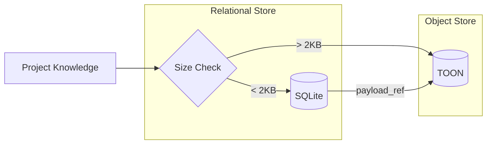

# Storage Substrate: The Persistence of Knowledge

To fulfill the [Local-First Philosophy](../getting-started/overview.md), Konteks uses a self-contained storage substrate. This layer is responsible for the durable preservation of the project's [Memory Model](memory-model.md) without relying on external cloud services or complex host installations.

## 1. The Relational Substrate (SQLite WASM)

The core of the storage layer is a single-file SQLite database (`memory.sqlite`). It serves as the source of truth for all structured knowledge, relationships, and metadata.

### Concepts

* **Zero-Install Persistence**: By using the WASM build of SQLite, Konteks runs entirely within the JavaScript runtime. No native database installation is required on the host machine.
* **Relational Integrity**: SQLite ensures that the complex links in our semantic graph remain consistent and queryable via standard SQL.

### Technical Specification: The Database

* **Runtime**: SQLite WebAssembly (WASM)
* **File Path**: `.konteks/memory.sqlite`
* **Primary Tables**: `entities`, `relations`, `chunks`, `observations`, `diary_entries`, `memory_events`.
* **Indexing**: Uses B-trees for fast entity lookup and FTS5 for full-text search.

## 2. The Object Substrate (TOON)

Larger payloads, such as full session summaries or extracted code bodies, are offloaded to the **TOON (Tagged Object Oriented Notation)** object store.

### Concepts

* **Content-Addressing**: Objects are stored based on the cryptographic hash of their content. This ensures that identical knowledge units are only stored once, regardless of where they appear in the project.
* **Payload Threshold**: Small payloads (default < 2KB) are stored "inline" within the SQLite database for maximum speed. Larger payloads are moved to the TOON store, with the database holding only a reference (`payload_ref`).
* **Database Leanness**: By offloading large text bodies to TOON files, the SQLite database remains small and fast, focusing only on indexes and relationships.

### Technical Specification: TOON Store

* **Storage Model**: Content-Addressed Storage (CAS)
* **Directory**: `.konteks/objects/`
* **File Format**: `.toon` (Plaintext with structured metadata)
* **Deduplication**: Content is hashed using SHA-256; if the hash exists, the write is skipped.

## 3. Configuration

The behavior of the storage substrate is controlled by `.konteks/config.json`.

* **`storage.inlinePayloadMaxBytes`**: The size threshold (in bytes) for storing content inline in SQLite vs. offloading to TOON.
* **`storage.memoryDir`**: The directory where all Konteks artifacts are stored (default: `.konteks`).

## 4. Data Integrity & Portability

The storage substrate is designed to be as portable as the code itself.

* **Durable vs. Derived**: The system distinguishes between authoritative user knowledge and reproducible mined artifacts. For more details, see the [Memory Model](memory-model.md#durable-vs-derived-data).
* **Atomic Transactions**: SQLite ensures that even if a session is interrupted, the memory remains in a consistent state.
* **Repository Centricity**: Because all files live within the `.konteks/` folder, your project's memory can be shared, backed up, or ignored using standard version control practices.

---

**How does information enter this substrate?** Read about [Semantic Extraction](extraction.md).
