# Database ERD

This is the current SQLite schema used by Konteks project memory. The diagram
shows real foreign keys as solid relationships and notes polymorphic links that
are enforced by application code rather than database constraints.

```mermaid
erDiagram
    sources {
        text id PK
        text type
        text uri
        text source_role
        text language
        text entities_json
        text metadata_json
        text topics_json
        text created_at
    }

    sections {
        text id PK
        text source_id FK
        text kind
        text path
        text anchor
        text anchor_type
        text summary
        text content_inline
        text content_hash
        text entities_json
        text metadata_json
        text topics_json
        integer token_count
        text deleted_at
        text suppressed_at
        text updated_at
    }

    entities {
        text id PK
        text type
        text name
        text canonical_name
        text summary
        text created_at
        text updated_at
    }

    entity_aliases {
        text id PK
        text entity_id FK
        text value
        text normalized_value
        text created_at
    }

    relations {
        text id PK
        text subject_id FK
        text predicate
        text object_id FK
        real confidence
        text status
        text valid_from
        text valid_to
        text supersedes_relation_id
        text properties_json
    }

    observations {
        text id PK
        text kind
        text text_inline
        text content_hash
        real confidence
        text deleted_at
        text suppressed_at
        text created_at
    }

    diary_entries {
        text id PK
        text subject
        text summary
        text tags_json
        text content_hash
        text deleted_at
        text suppressed_at
        text created_at
    }

    memory_events {
        text id PK
        text event_type
        text subject_type
        text subject_id
        text source_id FK
        text summary
        text actor
        text created_at
    }

    taxonomy_nodes {
        text id PK
        text parent_id FK
        text name
        text summary
        text created_at
        text updated_at
    }

    taxonomy_links {
        text id PK
        text node_id FK
        text target_type
        text target_id
        text created_at
    }

    retrieval_documents {
        text target_id PK
        text target_type PK
        text source_id
        text source_role
        text path
        text anchor
        text summary
        text fts_text
        text embedding_text
        text fts_hash
        text embedding_hash
        text updated_at
    }

    target_embeddings {
        text target_id PK
        text target_type PK
        text model PK
        integer dimensions
        text dtype
        integer normalized
        text embedding_hash
        blob vector_blob
        text created_at
    }

    modules {
        text id PK
        text path
        text source_role
        text package_name
        text summary
        text exported_symbols_json
        text imports_json
        text entities_json
        text topics_json
        integer file_count
        integer section_count
        text updated_at
    }

    section_suppressions {
        text path PK
        text anchor PK
        text content_hash PK
        text reason
        text created_at
    }

    memory_fts_indexed {
        text id PK
        text indexed_at
    }

    memory_fts {
        text id
        text type
        text kind
        text task
        text content
        text created_at
    }

    retrieval_documents_fts {
        text target_id
        text target_type
        text source_role
        text path
        text anchor
        text fts_text
    }

    sources ||--o{ sections : source_id
    sources ||--o{ memory_events : source_id
    entities ||--o{ entity_aliases : entity_id
    entities ||--o{ relations : subject_id
    entities ||--o{ relations : object_id
    taxonomy_nodes ||--o{ taxonomy_nodes : parent_id
    taxonomy_nodes ||--o{ taxonomy_links : node_id
```

## Polymorphic Targets

Several tables store a `target_type` plus `target_id` pair instead of a concrete
foreign key. Valid retrieval target types are:

* `section`: `target_id` points to `sections.id`.
* `memory`: `target_id` points to `observations.id`.
* `diary`: `target_id` points to `diary_entries.id`.
* `module`: `target_id` points to `modules.id`.

The polymorphic target tables are:

* `retrieval_documents`: canonical retrieval text for semantic and FTS indexing.
* `target_embeddings`: one vector per `(target_id, target_type, model)`.
* `retrieval_documents_fts`: FTS5 mirror of retrieval documents.
* `taxonomy_links`: attaches taxonomy nodes to sections or other target records.

Because these links are not database foreign keys, cleanup order matters. For
example, extracted section cleanup deletes `retrieval_documents` and
`target_embeddings` rows for `target_type = 'section'` before deleting the
matching `sections` rows.

`sources.entities_json`, `sections.entities_json`, and `modules.entities_json`
store graph entity ids associated with those retrieval targets. Recall uses
those ids to map text hits back into graph expansion.

## Search Tables

`memory_fts` and `retrieval_documents_fts` are SQLite FTS5 virtual tables owned
by SQL migrations. The Drizzle schema mirrors their columns for typed access,
but their table options live in `src/database/utils/migrations`.

`memory_fts_indexed` tracks which memory search documents have been indexed into
`memory_fts`.

## Main Domains

* Extraction: `sources`, `sections`, `modules`, `section_suppressions`.
* Durable memory: `observations`, `diary_entries`, `memory_events`.
* Graph memory: `entities`, `entity_aliases`, `relations`.
* Organization: `taxonomy_nodes`, `taxonomy_links`.
* Retrieval: `retrieval_documents`, `retrieval_documents_fts`,
  `target_embeddings`, `memory_fts`, `memory_fts_indexed`.

Graph relation `status` distinguishes active relations from `invalidated` and
`superseded` historical relations. `supersedes_relation_id` links an older
relation to the newer decision relation that replaced it.
