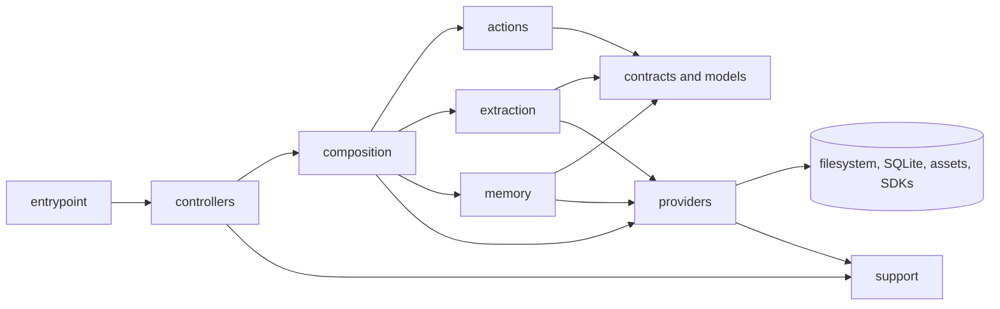

# Directory Structure

```text
src
├── main.ts             # Commander CLI entrypoint and command registration.
├── actions/            # Non-memory user workflow orchestration.
├── assets/             # Packaged prompt templates and other static runtime assets.
├── composition/        # Concrete wiring between controllers, actions, and providers.
├── contracts/          # Service and persistence boundaries that need substitution.
│   ├── repositories/   # Repository interfaces consumed by actions.
│   └── services/       # Service interfaces, such as extraction and embedding contracts.
├── controllers/        # Thin CLI command handlers and MCP server registration.
├── extraction/         # Extraction workflow orchestration and runtime wiring.
├── middlewares/        # Cross-command guards such as CLI project initialization.
├── memory/             # Memory feature workflows: recall, search, save, forget, warm-up, runtime wiring.
├── models/             # Core project, CLI, and memory data shapes.
├── providers/          # Local runtime capabilities.
│   ├── cli/            # CLI-specific input/output helpers.
│   ├── embeddings/     # Embedding providers and embedding pipeline behavior.
│   ├── extraction/     # Project extraction orchestration and engine internals.
│   ├── persistence/    # SQLite, query stores, migrations, and object payload storage.
│   ├── project/        # Project context resolution helpers.
│   └── protocol/       # MCP schemas, tool surface, and response formatting.
└── support/            # Project-owned generic utilities and test support.
    ├── fake/           # Test doubles shared across provider/controller tests.
    ├── format/         # Number and token formatting/estimation helpers.
    ├── json/           # JSON parse/stringify helpers.
    ├── object/         # Generic object/value helpers.
    ├── terminal/       # Terminal output and color helpers.
    └── version.ts      # Package version metadata.
```

## Code Flow

The outer layers translate protocol concerns into application requests.
Memory and extraction workflows live in dedicated feature folders. Other
composed workflows still use `composition` and `actions`. Providers contain
concrete runtime details.



Layer responsibilities:

- `main.ts` owns Commander registration and delegates to controllers.
- Controllers adapt CLI or MCP input/output and call composed operations.
- Composition wires non-memory actions to concrete providers for each workflow.
- Extraction owns project extraction workflow orchestration and project context loading.
- Memory owns recall, search, save, forget, warm-up, and MCP project/database runtime helpers.
- Actions express non-memory workflow behavior against contracts and models.
- Providers implement contracts and own filesystem, database, object storage, embedding, protocol-template, and SDK details.
- Middleware handles cross-cutting entrypoint checks before controllers run.
- Support stays generic, dependency-light, and reusable across layers.

Rules:

- Do not put workflow or provider selection logic in controllers.
- Do not import concrete providers from actions.
- Keep memory workflow code in `src/memory`; do not split recall/save/search orchestration across actions and composition.
- Keep extraction workflow code in `src/extraction`; do not split extraction orchestration across actions and composition.
- Providers must not import actions, controllers, or composition modules in production code.
- Run `bun scripts/check-architecture-boundaries.ts` after refactors that move workflow ownership.
- Prefer direct imports over barrel files, for example `@/providers/persistence/sqlite/database`.
- Keep `support` for project-owned generic utilities; do not use it as a re-export layer for third-party packages or Node built-ins.
- Preserve public CLI commands, MCP tool names, prompt names, and persisted database behavior during refactors.
