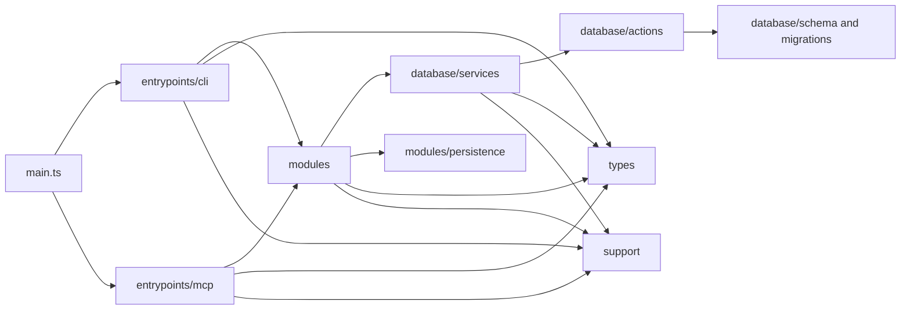

# Directory Structure

```text
src
├── main.ts             # Runtime entrypoint that starts the CLI or MCP server.
├── assets/             # Packaged grammar assets, prompt templates, and other static runtime assets.
├── database/           # SQLite schema, low-level actions, service adapters, migrations, and database policy helpers.
│   ├── actions/        # Focused database reads/writes and transaction/bootstrap helpers.
│   ├── services/       # Persistence-backed implementations for memory, project, status, transfer, and taxonomy workflows.
│   ├── support/        # Database-specific policies, scoring, transfer types, and retrieval text helpers.
│   └── utils/          # Database utilities, including raw SQL migrations.
├── entrypoints/        # Protocol adapters for external callers.
│   ├── cli/            # Commander command classes, subcommands, registry, and shared BaseCommand.
│   └── mcp/            # MCP tools, prompts, schemas, error handling, and tool output helpers.
├── modules/            # Application workflows and concrete runtime capabilities.
│   ├── cli/            # CLI workflow helpers such as grammar selection.
│   ├── embeddings/     # Embedding providers and embedding generation pipeline.
│   ├── extraction/     # Project extraction orchestration and extraction engine internals.
│   ├── memory/         # Recall, save, transfer, and runtime wiring for memory workflows.
│   ├── persistence/    # Object payload storage and serialized content helpers.
│   └── project/        # Project context, source classification, and warm-up ranking.
├── support/            # Project-owned generic utilities and test-light infrastructure helpers.
│   ├── cli/            # CLI user error and JSON output helpers.
│   ├── format/         # Number and token formatting/estimation helpers.
│   ├── json/           # JSON file I/O helpers.
│   ├── object/         # Generic object/value helpers.
│   ├── terminal/       # Terminal output and color helpers.
│   └── tui/            # Small terminal UI components.
└── types/              # Shared domain contracts and public data shapes.

tests
├── fake/               # Test doubles shared across feature and unit tests.
├── features/           # Comprehensive behavior, integration, CLI, MCP, storage, and workflow tests.
├── support/            # Test support utilities.
└── units/              # Focused unit tests for small policies, mappers, schemas, and helpers.
```

## Code Flow

Entrypoints translate CLI and MCP protocol concerns into application requests.
Modules own workflow orchestration and runtime capabilities. Database owns the
SQLite boundary and persistence-backed service implementations. Shared domain
types stay in `types`, and generic helpers stay in `support`.


