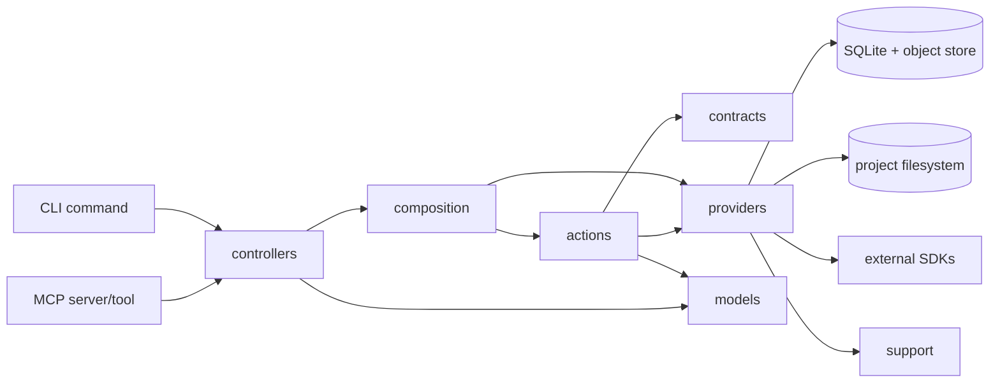

# Directory Structure

```text
src/app
├── actions/            # User workflow orchestration, such as recall/save/warm-up.
├── composition/        # Concrete wiring between controllers, actions, and providers.
├── contracts/          # Service and persistence boundaries that need substitution.
├── controllers/        # Thin CLI and MCP entrypoints.
├── models/             # Core project and memory data shapes.
├── providers/          # Local runtime capabilities.
│   ├── cli/            # CLI-specific input/output helpers.
│   ├── embeddings/     # Embedding providers and embedding pipeline behavior.
│   ├── extraction/     # Project extraction orchestration and engine internals.
│   ├── persistence/    # SQLite, query stores, migrations, and object payload storage.
│   ├── project/        # Project context resolution helpers.
│   └── protocol/       # MCP schemas, tool surface, and response formatting.
└── support/            # Generic wrappers/helpers for SDKs, terminal, JSON, files, etc.
```

## Code Flow



Rules:

- Keep filenames kebab-case.
- Prefer expressive action, service, repository, and contract names.
- Keep controllers thin; do workflow orchestration in actions and feature modules.
- Keep providers below actions/controllers/repositories; providers must not import those upper layers in production code.
- Prefer direct imports over barrel files.
- Import provider capabilities directly from their grouped provider paths, such as `@/app/providers/persistence/sqlite/database`.
- Preserve public CLI commands, MCP tool names, prompt names, and persisted database behavior during refactors.
