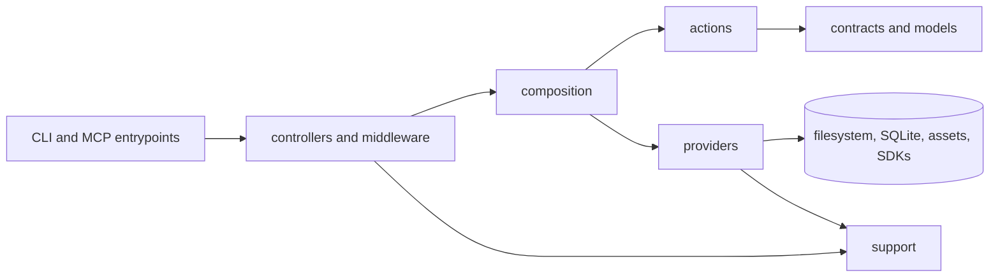

# Directory Structure

```text
src/app
├── actions/            # User workflow orchestration, such as recall/save/warm-up.
├── assets/             # Packaged prompt templates and other static runtime assets.
├── composition/        # Concrete wiring between controllers, actions, and providers.
├── contracts/          # Service and persistence boundaries that need substitution.
│   ├── repositories/   # Repository interfaces consumed by actions.
│   └── services/       # Service interfaces, such as mining and embedding contracts.
├── controllers/        # Thin CLI and MCP entrypoints.
│   ├── cli/            # CLI command handlers.
│   └── mcp/            # MCP server transport and registration.
├── middlewares/        # Cross-command guards such as CLI project initialization.
├── models/             # Core project and memory data shapes.
├── providers/          # Local runtime capabilities.
│   ├── cli/            # CLI-specific input/output helpers.
│   ├── embeddings/     # Embedding providers and embedding pipeline behavior.
│   ├── extraction/     # Project extraction orchestration and engine internals.
│   ├── persistence/    # SQLite, query stores, migrations, and object payload storage.
│   ├── project/        # Project context resolution helpers.
│   └── protocol/       # MCP schemas, tool surface, and response formatting.
└── support/            # Project-owned generic utilities only.
    ├── format/         # Number and token formatting/estimation helpers.
    ├── json/           # JSON parse/stringify helpers.
    ├── object/         # Generic object/value helpers.
    ├── terminal/       # Terminal output and color helpers.
    └── version.ts      # Package version metadata.
```

## Code Flow

The outer layers translate protocol concerns into application requests,
composition wires concrete workflows, actions own workflow decisions, and
providers contain concrete runtime details.



Layer responsibilities:

- Controllers should parse input, call one action or composed application
  operation, and format output.
- Composition should be the only place that chooses concrete providers for an
  application workflow.
- Actions should depend on contracts and models, not concrete providers.
- Providers should implement contracts and own all filesystem, database, object
  storage, embedding, protocol-template, and SDK details.
- Middleware should handle cross-cutting entrypoint checks before controllers
  run, without taking over workflow behavior.
- Support utilities should stay generic and dependency-light.

Rules:

- Keep filenames kebab-case.
- Prefer expressive action, service, repository, and contract names.
- Keep controllers thin; do workflow orchestration in actions and feature modules.
- Keep providers below actions/controllers/repositories; providers must not import those upper layers in production code.
- Prefer direct imports over barrel files.
- Import provider capabilities directly from their grouped provider paths, such as `@/app/providers/persistence/sqlite/database`.
- Keep `support` for project-owned generic utilities; do not use it as a re-export layer for third-party packages or Node built-ins.
- Preserve public CLI commands, MCP tool names, prompt names, and persisted database behavior during refactors.
