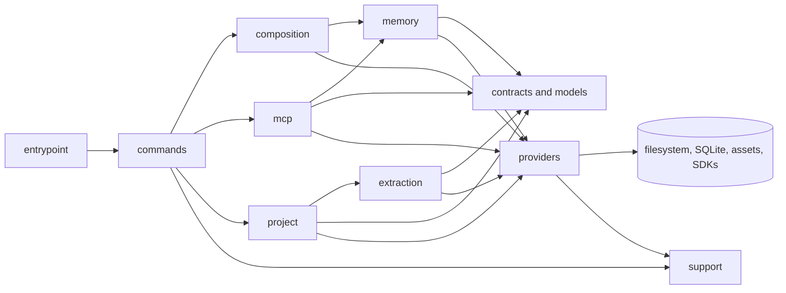

# Directory Structure

```text
src
├── main.ts             # Commander CLI entrypoint and command registration loop.
├── assets/             # Packaged prompt templates and other static runtime assets.
├── commands/           # CLI command classes, nested subcommands, registry, and shared BaseCommand.
├── composition/        # Skill installation and memory transfer composition.
├── contracts/          # Service and persistence boundaries that need substitution.
│   ├── repositories/   # Repository interfaces consumed by workflows.
│   └── services/       # Service interfaces, such as extraction and embedding contracts.
├── extraction/         # Extraction workflow orchestration and runtime wiring.
├── middlewares/        # Cross-command guards such as CLI project initialization.
├── memory/             # Memory feature workflows: recall, search, save, forget, warm-up, runtime wiring.
├── mcp/                # MCP tools, prompts, handler dispatch, and dry-run orchestration.
├── models/             # Core project, CLI, and memory data shapes.
├── project/            # Project lifecycle workflows: init, status, repair, grammar selection.
├── providers/          # Local runtime capabilities.
│   ├── cli/            # CLI-specific input/output helpers.
│   ├── embeddings/     # Embedding providers and embedding pipeline behavior.
│   ├── extraction/     # Project extraction orchestration and engine internals.
│   ├── persistence/    # SQLite, query stores, migrations, and object payload storage.
│   ├── project/        # Project context resolution helpers.
│   └── protocol/       # Prompt templates and protocol-facing prompt fixtures.
└── support/            # Project-owned generic utilities and test support.
    ├── fake/           # Test doubles shared across provider/command tests.
    ├── format/         # Number and token formatting/estimation helpers.
    ├── json/           # JSON parse/stringify helpers.
    ├── object/         # Generic object/value helpers.
    ├── terminal/       # Terminal output and color helpers.
    └── version.ts      # Package version metadata.

tests
├── features/           # Comprehensive behavior, integration, CLI, MCP, storage, and workflow tests.
└── units/              # Focused important unit tests for small policies, mappers, schemas, and helpers.
```

## Code Flow

The outer layers translate protocol concerns into application requests.
Memory, extraction, MCP, and project lifecycle workflows live in dedicated
feature folders. Skill installation and memory transfer still use
`composition`. Providers contain concrete runtime details.



Layer responsibilities:

- `main.ts` owns the Commander entrypoint and registers command classes from `src/commands`.
- Commands extend `BaseCommand`, adapt CLI input/output, and call composed operations or feature workflows.
- `commands/index.ts` owns the command registry lists used by `main.ts`.
- `commands/_base-command.ts` owns shared command behavior and re-exports the Commander `Command` type for command files.
- Subcommands live in a directory named after their parent command, such as `commands/mcp/*` and `commands/memory/*`.
- Composition owns skill installation and memory transfer wiring.
- Extraction owns project extraction workflow orchestration and project context loading.
- Memory owns recall, search, save, forget, warm-up, and MCP project/database runtime helpers.
- MCP owns tool classes, schemas, tool output formatting, prompt listing, tool dispatch, and dry-run orchestration.
- Project owns init, status, repair, and grammar selection workflows.
- Providers implement contracts and own filesystem, database, object storage, embedding, protocol-template, and SDK details.
- Middleware handles cross-cutting entrypoint checks before command handlers run.
- Support stays generic, dependency-light, and reusable across layers.

Rules:

- Tests live under `tests/features` or `tests/units`; do not place `*.test.ts` files under `src`.
- Prefer feature tests for user-visible behavior, MCP protocol behavior, CLI flows, persistence workflows, extraction, and memory lifecycle behavior.
- Group feature tests by behavior or workflow instead of mirroring one test file per source file.
- Use unit tests only for important pure logic that is cheaper and clearer to verify directly than through a feature test.
- Do not add placeholder tests that only assert exports, type compilation, static command metadata, or `typeof` contracts.
- Command files should default-export their main command class, and the filename should reflect that class.
- Place subcommands under a folder named after the parent command.
- Command files that configure Commander arguments/options should import the `Command` type from `@/commands/_base-command`, not directly from `commander`.
- Do not put workflow or provider selection logic in commands.
- Keep memory workflow code in `src/memory`; do not split recall/save/search orchestration across command classes and composition.
- Keep extraction workflow code in `src/extraction`; do not split extraction orchestration across command classes and composition.
- Keep MCP tool, prompt, handler, and dry-run code in `src/mcp`; do not split MCP orchestration across composition.
- MCP tools live as one default-export class per file under `src/mcp/tools`; each tool owns its name, description, annotations, input schema, validation, execution, and output formatting.
- `src/mcp/tools/index.ts` should stay a simple ordered registry of tool instances.
- Shared MCP tool utilities should live under `src/mcp/tools/utils` only when reused by multiple tool classes.
- Keep project lifecycle workflow code in `src/project`; do not split init/status/repair orchestration across command classes and composition.
- Providers must not import commands or composition modules in production code.
- Run `bun scripts/check-architecture-boundaries.ts` after refactors that move workflow ownership.
- Prefer direct imports over barrel files, for example `@/providers/persistence/sqlite/database`.
- Keep `support` for project-owned generic utilities; do not use it as a re-export layer for third-party packages or Node built-ins.
- Preserve public CLI commands, MCP tool names, prompt names, and persisted database behavior during refactors.
