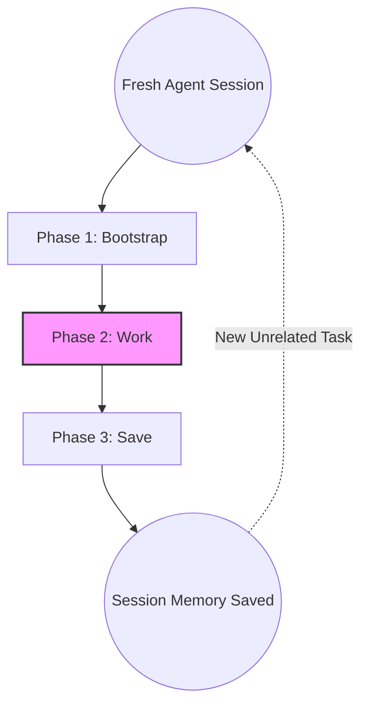

# Session Lifecycle

Konteks is designed around a structured **Bootstrap -> Work -> Save** model. Following this rhythm keeps your AI agent context-aware without carrying unrelated task baggage.

## Phase 1: Bootstrap

When you open a fresh AI agent session in a project, start by giving it the project-level picture.

- **Action**: Tell the agent to use the `konteks_bootstrap` tool.
- **Goal**: Ensure the agent is familiar with the project without you manually explaining architecture, constraints, and durable decisions.

> **Resuming a Session**: If you close your agent before finishing a task and later resume the same session, you can skip Bootstrap because the agent already has the project briefing in context.

## Phase 2: Work

This is where development happens. Because the agent already has project context, the work phase depends on whether you are changing something existing or starting something new.

### Existing Work: Recall First

If you are modifying existing code, **Recall is mandatory before implementation**.

- **Action**: Tell the agent to recall the specific feature, module, file, or symbol, for example: "Recall how our auth feature works."
- **Goal**: Make sure the agent understands current constraints before it suggests changes.

### New Work: Direct Start

If you are starting work on a completely new feature that Konteks hasn't seen before:

- **Action**: Prompt the task directly.
- **Goal**: Let the agent discover new context during implementation and record durable findings during Save.

Recall is optional for genuinely new work. Use it only when the new feature touches known modules, constraints, or prior decisions.

## Phase 3: Save

Once the goal is achieved or meaningful progress should be preserved, save the agent's work back to Konteks.

- **Action**: Tell the agent to save the current session to Konteks using the `konteks_save` tool.
- **Goal**: Record durable progress, decisions, and task state so future sessions do not repeat the same discovery work.

> **Recommendation**: Prefer saving when the current task is complete. If the task is partial, pause and resume the same agent session when possible.

## New Task Flow

To maintain high-fidelity context, **Konteks sessions should be atomic.**

When you move to a new, unrelated task:

1. **Save** the current session.
2. **Start** a fresh agent session for the unrelated task.
3. **Bootstrap** again to orient the agent to the project (not the previous task).

This fresh start prevents context pollution and keeps unrelated work from leaking into the next task.
