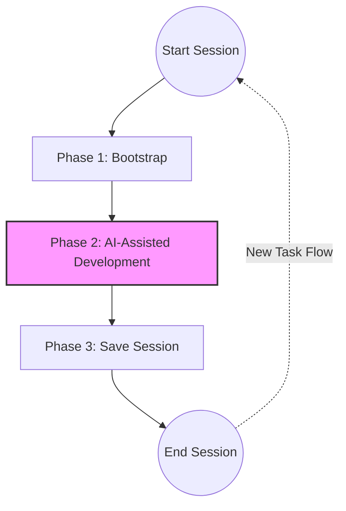

# The Session Lifecycle

Konteks is designed around a structured **3-Phase Session** model. Following this rhythm ensures your AI agent remains efficient and context-aware.

## Phase 1: Start Session (Bootstrap)

When you open your AI agent for the first time in a project, start by giving it the "big picture."

* **Action**: Tell the agent to use the `konteks_bootstrap` tool.
* **Goal**: Ensure the agent is "familiar" with the project without you typing a single word of explanation.

> **Resuming a Session**: If you close your agent before finishing a task and later resume the same session, you can skip this phase as the agent already has the project briefing in its context.

## Phase 2: AI-Assisted Development

This is where the actual work happens. Because your agent is "familiar" with the project, you can move faster with less friction. The flow depends on your goal.

### A. Improving Existing Features (The Recall Pre-phase)

If you are modifying existing code, **Recall is a mandatory pre-phase**.

* **Step**: Tell the agent to "recall" the specific feature, module, or symbol (e.g., "Recall how our auth feature works").
* **Why**: You can only collaborate with AI effectively if the agent knows the rules. Recalling ensures it understands current constraints *before* it suggests changes.

### B. Developing New Features

If you are starting work on a completely new feature that Konteks hasn't seen before:

* **Step**: Prompt the task directly.
* **Logic**: Recall is **optional** here. Since the feature is new, you provide the initial direction, and the agent will record its findings for the first time during Phase 3.

## Phase 3: End Session (Save Session)

Once your goal is achieved or you've made significant progress, you must save the agent's work back to Konteks.

* **Action**: Tell the agent to "save the current session to Konteks" using the `konteks_save` tool.
* **Goal**: Record progress, decisions, and task state so the next agent can pick up where you left off.

> **Recommendation**: Only "End" the session once the current task is completed. If the task is partial, simply pause and resume later (Phase 2).

## The New Task Flow (Repetition)

To maintain high-fidelity context, **Konteks sessions should be atomic.**

When you move to a new, unrelated task:

1. **End** the current session (Save).
2. **Start** a fresh agent session.
3. **Bootstrap** again to orient the agent to the project (not the previous task).

This "fresh start" prevents context pollution and ensures the agent isn't carrying over baggage or decisions from unrelated work.
