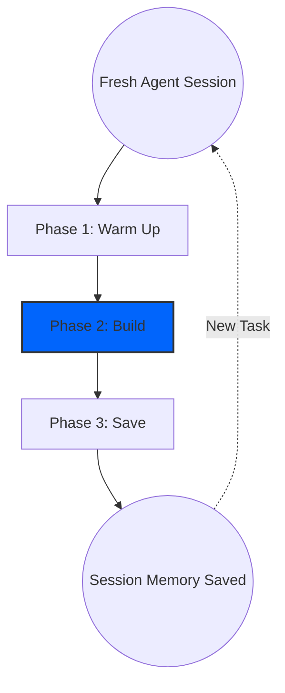

# Session Lifecycle

Konteks is designed around a structured **Warm Up -> Build -> Save** model. Following this rhythm keeps your AI agent context-aware without carrying unrelated task baggage.



## Phase 1: Warm Up

When you open a fresh AI agent session in a project, start by giving it the project-level picture.

Use the `/warm-up` prompt to start this phase. This ensures the agent is familiar with the project without you manually explaining architecture, constraints, and durable decisions.

> [!NOTE]
> Resuming a Session: If you close your agent before finishing a task and later resume the same session, you can skip Warm Up because the agent already has the project briefing in context.

## Phase 2: Build

This is where development happens. Because the agent already has project context, this phase depends on whether you are improving an existing feature or starting a new one.

### Working on Existing Feature

If you are modifying existing code, start with the existing-task workflow.

```text
/work-on-existing improve auth session and propose a safe refactor to reduce token refresh race conditions.
```

The `/work-on-existing` prompt helps the agent understand current constraints before it suggests changes.

### Working on New Feature

If you are starting a completely new task that Konteks hasn't seen before:

```text
/work-on-new design and implement a lightweight notification center for failed background jobs.
```

The `/work-on-new` prompt helps the agent discover new context during implementation and record durable findings during Save.

> [!TIP]
> Recall is a supplement during Build. If an existing or new feature touches known modules, constraints, or prior decisions, run `/recall` first to pull relevant context.

## Phase 3: Save

Once the goal is achieved or meaningful progress should be preserved, save the agent's work back to Konteks.

Use the `/save-session` prompt to persist the outcome of the current task. This records durable progress, decisions, and task state so future sessions do not repeat the same discovery work.

> [!TIP]
> Recommendation: Prefer saving when the current task is complete. If the task is partial, pause and resume the same agent session when possible.

## Repeat the Cycle

To maintain high-fidelity context, **Konteks sessions should be atomic.**

Once you have completed a task, you can repeat the cycle to work on a new task. The fresh agent session helps the agent orient itself to the new task and prevent context pollution.
