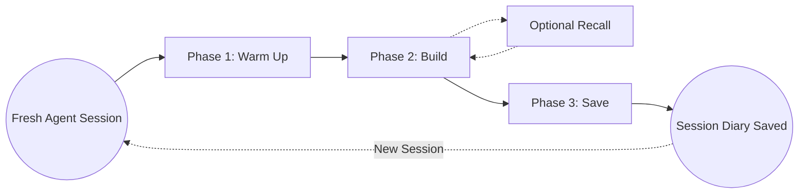

# Session Lifecycle

Konteks is designed around a structured **Warm Up -> Build -> Save** model. Following this rhythm keeps your coding agent context-aware without carrying unrelated task baggage.

A **[session](../reference/glossary.md#session)** is one continuous agent conversation in a project. It can contain one task or several related tasks. The boundary is not "one prompt" or "one task"; the boundary is whether the work still shares the same goal, files, constraints, or decision chain.



## Phase 1: Warm Up

When you open a fresh coding agent session in a project, start by giving it the project-level picture.

Use the `/konteks-warm-up` prompt to start this phase. This ensures the agent is familiar with the project without you manually explaining architecture, constraints, and durable decisions.

```text
/konteks-warm-up
```

If the next task already needs specific memory, append an optional topic so the agent can load focused supplemental memory after the project briefing:

```text
/konteks-warm-up security, authentication, and authorization
```

> [!NOTE]
> Resuming a Session: If you close your agent before finishing a task and later resume the same session, you can skip Warm Up because the agent already has the project briefing in context.

Start a fresh session when the next work is unrelated, needs a different project briefing, or would make the current agent context noisy. See [Session Boundary](../reference/glossary.md#session-boundary) for the short definition.

## Phase 2: Build

This is where development happens. Because the agent already has project context, you can give it the task directly and continue your normal coding workflow.

> [!TIP]
> Recall is a supplement during Build, not a required step for every task.

Use `/konteks-recall` when the task depends on known modules, constraints, prior decisions, or historical context:

```text
/konteks-recall explain the current authentication flow and related decisions
```

After recall returns context, use it as supporting evidence for the task. If the task is small, local, or already clear from the active conversation, skip recall and work directly.

## Phase 3: Save

When the session is ending or meaningful progress should be preserved, save the agent's work back to Konteks.

Use the `/konteks-save` prompt to persist the outcome of the current agent session:

```text
/konteks-save
```

A single session can contain one task or several related tasks. The agent saves compact structured durable memories first, then writes one session diary summarizing the outcome. Durable memories should be future-useful rules, decisions, constraints, preferences, blockers, or code insights. The diary should be a compact summary of the task, outcome, verification, unresolved questions, and exact next steps.

> [!TIP]
> Recommendation: Prefer saving when the session is complete or about to be closed. If progress is partial, the session diary should include pending items and exact next steps.

Do not save raw transcripts, command logs, routine chronology, or low-value implementation noise. If a session was trivial, abandoned, or produced no reusable context, it is okay to skip Save.

## Repeat the Cycle

To maintain high-fidelity context, **Konteks sessions should stay coherent.**

Once you finish a session, you can repeat the cycle in a fresh agent session. Keeping unrelated work in separate sessions helps the agent orient itself and reduces context pollution.
