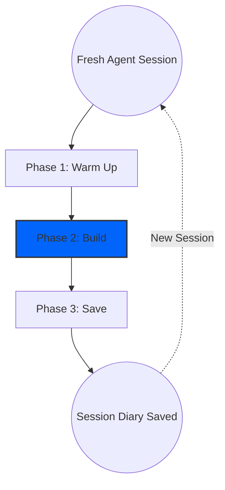

# Session Lifecycle

Konteks is designed around a structured **Warm Up -> Build -> Save** model. Following this rhythm keeps your AI agent context-aware without carrying unrelated task baggage.

A **[session](../reference/glossary.md#session)** is one continuous agent conversation in a project. It can contain one task or several related tasks. The boundary is not "one prompt" or "one task"; the boundary is whether the work still shares the same goal, files, constraints, or decision chain.



## Phase 1: Warm Up

When you open a fresh AI agent session in a project, start by giving it the project-level picture.

Use the `/konteks-warm-up` prompt to start this phase. This ensures the agent is familiar with the project without you manually explaining architecture, constraints, and durable decisions. If the next task is already needed some memory prior to warm up, append an optional free-form focus so the agent can load focused memory after the project briefing.

> [!NOTE]
> Resuming a Session: If you close your agent before finishing a task and later resume the same session, you can skip Warm Up because the agent already has the project briefing in context.

Start a fresh session when the next work is unrelated, needs a different project briefing, or would make the current agent context noisy. See [Session Boundary](../reference/glossary.md#session-boundary) for the short definition.

## Phase 2: Build

This is where development happens. Because the agent already has project context, this phase depends on whether you are improving an existing feature or starting a new one.

### Working on Existing Feature

If you are modifying existing code, start with the existing-task workflow.

```text
/konteks-work-on-existing improve auth session and propose a safe refactor to reduce token refresh race conditions.
```

The `/konteks-work-on-existing` prompt helps the agent understand current constraints before it suggests changes.

### Working on New Feature

If you are starting a completely new task that Konteks hasn't seen before:

```text
/konteks-work-on-new design and implement a lightweight notification center for failed background jobs.
```

The `/konteks-work-on-new` prompt helps the agent discover new context during implementation and record durable findings during Save.

> [!TIP]
> Recall is a supplement during Build. If an existing or new feature touches known modules, constraints, or prior decisions, run `/konteks-recall` first to pull relevant context.

## Phase 3: Save

When the session is ending or meaningful progress should be preserved, save the agent's work back to Konteks.

Use the `/konteks-save` prompt to persist the outcome of the current agent session. A single session can contain one task or several related tasks. The agent saves compact structured durable memories first, then writes one session diary summarizing the outcome.

> [!TIP]
> Recommendation: Prefer saving when the session is complete or about to be closed. If progress is partial, the session diary should include pending items and exact next steps.

## Repeat the Cycle

To maintain high-fidelity context, **Konteks sessions should stay coherent.**

Once you finish a session, you can repeat the cycle in a fresh agent session. Keeping unrelated work in separate sessions helps the agent orient itself and reduces context pollution.

Use this boundary in practice:

* Same session: fix a bug, update tests, and save a follow-up decision for the same feature.
* Same session: implement a feature and adjust nearby modules discovered during that implementation.
* Fresh session: switch from authentication work to packaging, UI copy, or unrelated infrastructure cleanup.
